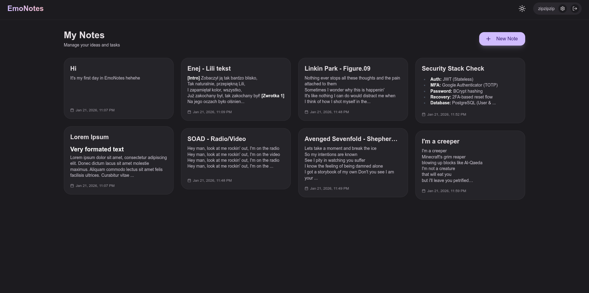
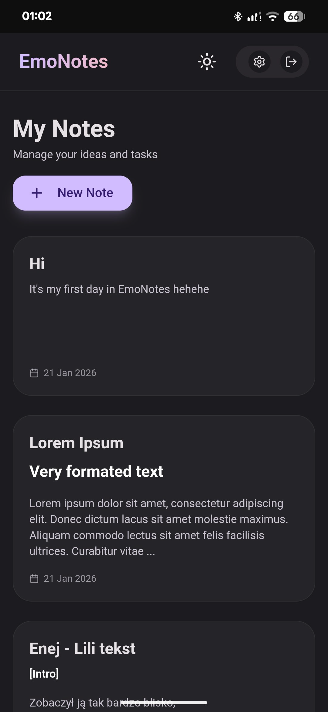
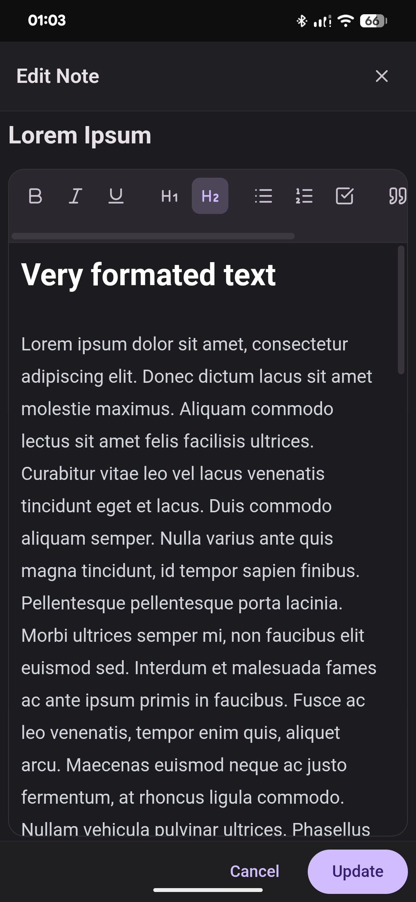

# EmoNotes
## EmoNotes is a secure, high-performance note-taking application designed for self-hosting. It features a robust Spring Boot backend, a modern React frontend, and a multi-layered security system including Multi-Factor Authentication (TOTP).

  

  
  &nbsp;&nbsp;&nbsp;&nbsp;
  

## Technologies
- Backend: Java 21 with Spring Boot 3.5.
- Security: Spring Security, JWT (JSON Web Tokens), BCrypt password hashing.
- MFA: Google Authenticator (TOTP) support.
- Database: PostgreSQL for persistent storage.
- Frontend: React with Vite and Tailwind CSS.
- Deployment: Docker and Docker Compose.
- Web Server: Nginx as a reverse proxy.

## Features
- Secure Authentication: JWT-based stateless authorization.
- Mandatory MFA: Multi-Factor Authentication setup during registration to ensure account ownership.
- Note Management: Full CRUD (Create, Read, Update, Delete) functionality for personal notes.
- Optimized Performance: Content truncation on the backend for fast dashboard loading.
- Self-Hosted: Full control over your data with easy Docker deployment.
- Mobile Ready: Responsive design for seamless use on smartphones.

Setup Instructions
1. Clone the repository
   Bash `git clone https://github.com/yourusername/emonotes.git
2. Configure environment variables
   Create a .env file in the root directory and fill in the following parameters:
   - `POSTGRES_HOST`
   - `POSTGRES_PORT`
   - `POSTGRES_USER`
   - `POSTGRES_PASSWORD`
   - `POSTGRES_DB`
   - `SPRING_DATASOURCE_URL`
   - `SPRING_SECURITY_KEY`
3. Build and run with Docker
   Bash
`docker compose up -d --build`
4. The application will be available at http://localhost.

## Usage
### Registration and MFA
1. Navigate to the signup page.
2. Enter your credentials.
3. Scan the generated QR code with Google Authenticator or enter the secret key manually.
4. Verify the setup with a 6-digit code to complete registration.

### Password Recovery
If you forget your password, you can reset it by providing your username and the current 6-digit code from your Google Authenticator app.

Developed by @datapeice <3